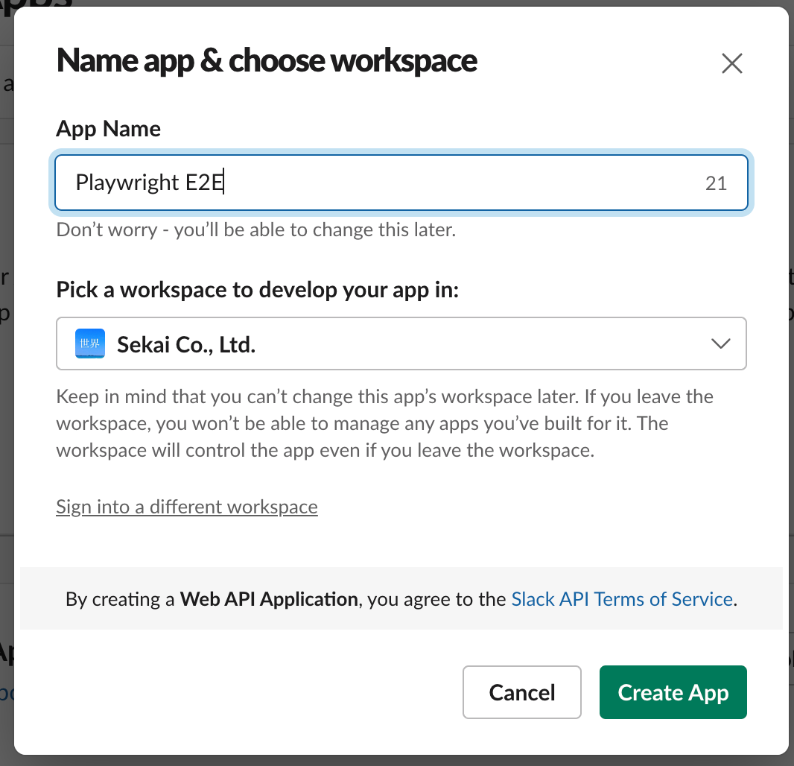
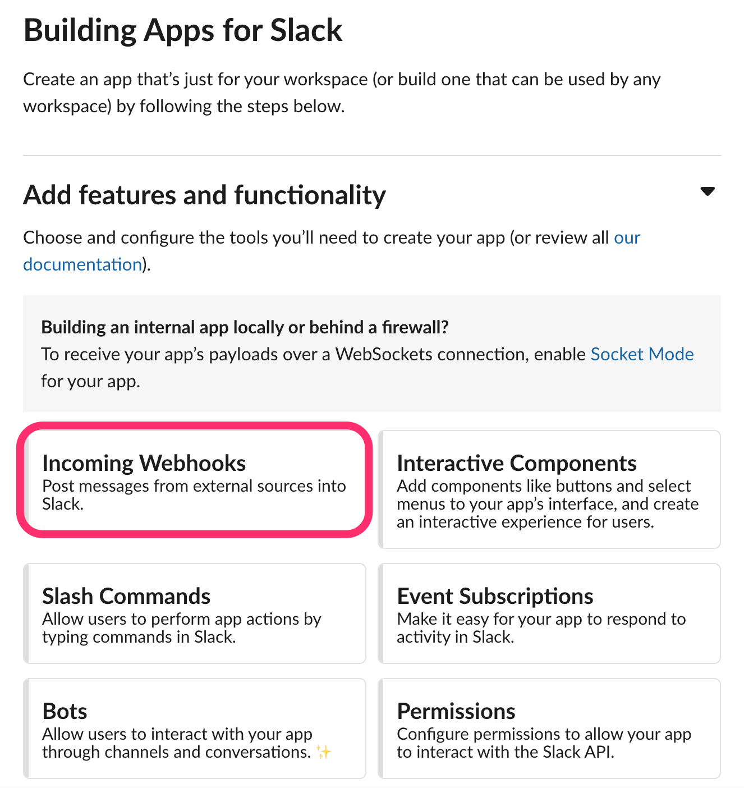
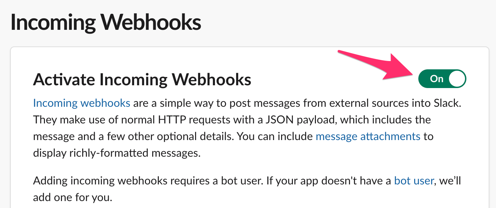
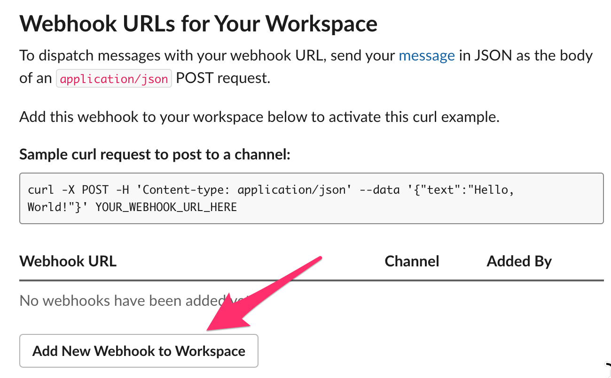
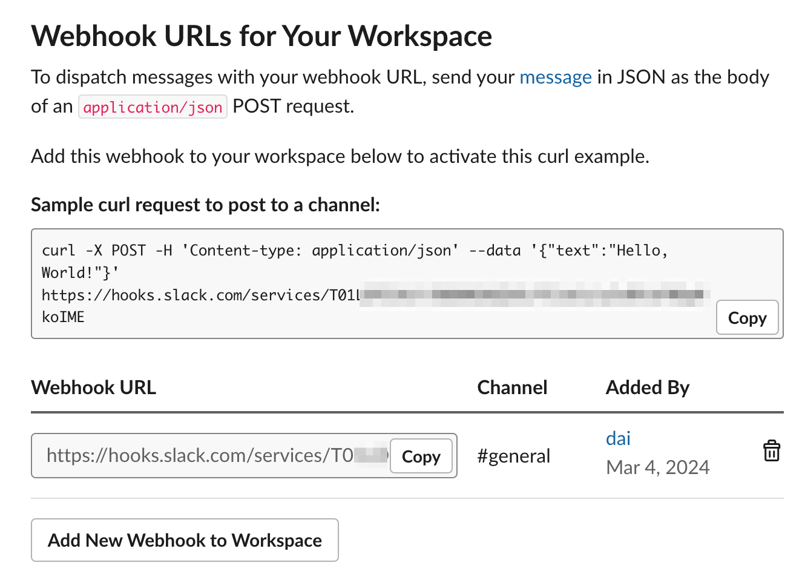
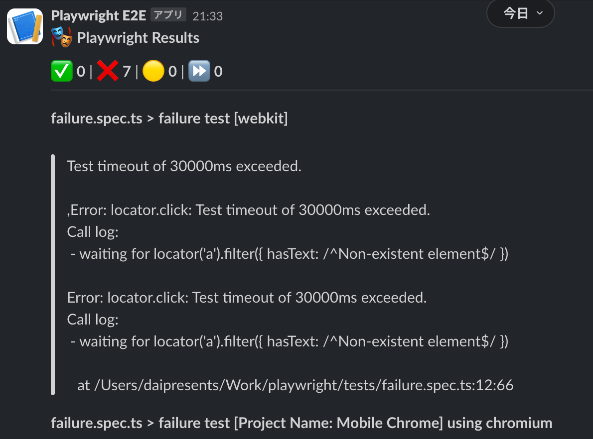
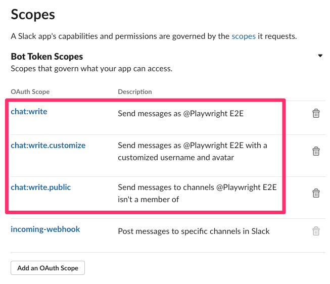
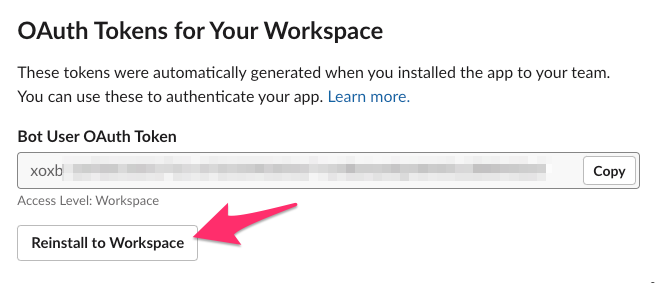
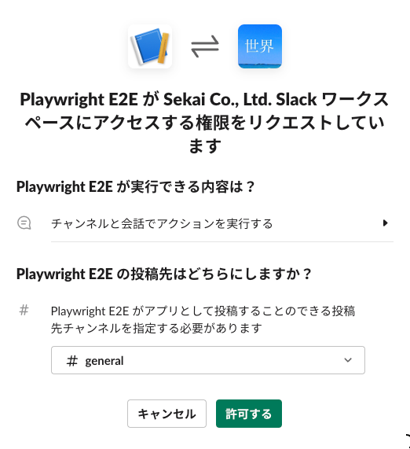
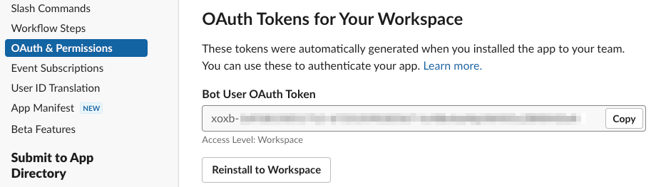

[README](../README.md) > Notification

# Notification

## Slack
See https://www.npmjs.com/package/playwright-slack-report

Install.

```
npm install playwright-slack-report -D
```

### via Webhook
See https://www.npmjs.com/package/playwright-slack-report#option-a---send-your-results-via-a-slack-webhook

Create Slack app to get incoming webhook from https://api.slack.com/messaging/webhooks.
A thread is not supported.









Modify your `playwright.config.ts` file to include the following:

```
reporter: [
  [
    "./node_modules/playwright-slack-report/dist/src/SlackReporter.js",
    {
      slackWebHookUrl: process.env.SLACK_HOOK,
      sendResults: "always", // "always" , "on-failure", "off"
    },
  ],
],
```

And add HOOK URL to `.env`:

```
# Slack
SLACK_HOOK="https://hooks.slack.com/services/HOOK_URL"
```

Notification sample:




### via Slack bot user
See https://www.npmjs.com/package/playwright-slack-report#option-b---send-your-results-via-a-slack-bot-user

After creating app, open `OAuth & Permissions` and set up `Scopes` like below:



Install/Reinstall to Workspace:



Allow the permission:



Copy `Bot User OAuth Token`:



Run test:

```
SLACK_BOT_USER_OAUTH_TOKEN=xoxb-YOUR_TOKEN npx playwright test ./tests/failure.spec.ts

Running 1 test using 1 worker

  ✘  1 [Google Chrome] › failure.spec.ts:6:5 › failure test (30.0s)
  ✘  2 [Google Chrome] › failure.spec.ts:6:5 › failure test (retry #1) (30.0s)

...

[DEBUG]  web-api:WebClient:0 initialized
[DEBUG]  web-api:WebClient:0 apiCall('chat.postMessage') start
[DEBUG]  web-api:WebClient:0 http request url: https://slack.com/api/chat.postMessage
[DEBUG]  web-api:WebClient:0 http request body: {"channel":"general","text":"✅ 0 ❌ 1  🟡 0 ⏩ 0","unfurl_link":true,"blocks":"[{\"type\":\"section\",\"text\":{\"type\":\"mrkdwn\",\"text\":\"🎭 *Playwright Results*\"}},{\"type\":\"section\",\"text\":{\"type\":\"mrkdwn\",\"text\":\"✅ *0* | ❌ *1* | 🟡 *0* | ⏩ *0*\"}},{\"type\":\"divider\"},{\"type\":\"section\",\"text\":{\"type\":\"mrkdwn\",\"text\":\"*failure.spec.ts > failure test [Project Name: Google Chrome] using chromium*\\n        \\n>Test timeout of 30000ms exceeded.\\r\\n>\\r\\n>,Error: locator.click: Test timeout of 30000ms exceeded.\\n>Call log:\\n>  - waiting for locator('a').filter({ hasText: /^Non-existent element$/ })\\n>\\r\\n>Error: locator.click: Test timeout of 30000ms exceeded.\\n>Call log:\\n>  - waiting for locator('a').filter({ hasText: /^Non-existent element$/ })\\n>\\n>    at /Users/daipresents/Work/playwright/tests/failure.spec.ts:12:66\\r\\n>\"}}]"}
[DEBUG]  web-api:WebClient:0 http request headers: {}
[DEBUG]  web-api:WebClient:0 http response received
[DEBUG]  web-api:WebClient:0 http request result: {"ok":true,"channel":"CHANNEL_ID","ts":"1709597075.402349","message":{"user":"USER_ID","type":"message","ts":"1709597075.402349","bot_id":"BOT_ID","app_id":"APP_ID","text":":white_check_mark: 0 :x: 1  :large_yellow_circle: 0 :fast_forward: 0","team":"T01LDPZ1HLY","bot_profile":{"id":"ID","app_id":"APP_ID","name":"Playwright E2E","icons":{"image_36":"https://a.slack-edge.com/80588/img/plugins/app/bot_36.png","image_48":"https://a.slack-edge.com/80588/img/plugins/app/bot_48.png","image_72":"https://a.slack-edge.com/80588/img/plugins/app/service_72.png"},"deleted":false,"updated":1709555033,"team_id":"TEAM_ID"},"blocks":[{"type":"section","block_id":"BLOCK_ID","text":{"type":"mrkdwn","text":":performing_arts: *Playwright Results*","verbatim":false}},{"type":"section","block_id":"fC4JH","text":{"type":"mrkdwn","text":":white_check_mark: *0* | :x: *1* | :large_yellow_circle: *0* | :fast_forward: *0*","verbatim":false}},{"type":"divider","block_id":"BLOCK_ID"},{"type":"section","block_id":"BLOCK_ID","text":{"type":"mrkdwn","text":"*failure.spec.ts &gt; failure test [Project Name: Google Chrome] using chromium*\n        \n&gt;Test timeout of 30000ms exceeded.\n&gt;\n&gt;,Error: locator.click: Test timeout of 30000ms exceeded.\n&gt;Call log:\n&gt;  - waiting for locator('a').filter({ hasText: /^Non-existent element$/ })\n&gt;\n&gt;Error: locator.click: Test timeout of 30000ms exceeded.\n&gt;Call log:\n&gt;  - waiting for locator('a').filter({ hasText: /^Non-existent element$/ })\n&gt;\n&gt;    at /Users/daipresents/Work/playwright/tests/failure.spec.ts:12:66\n&gt;","verbatim":false}}]},"response_metadata":{"scopes":["incoming-webhook","chat:write","chat:write.customize","chat:write.public"],"acceptedScopes":["chat:write"]}}
[DEBUG]  web-api:WebClient:0 apiCall('chat.postMessage') end
✅ Message sent to general
[
  {
    "channel": "general",
    "outcome": "✅ Message sent to general",
    "ts": "1709597075.402349"
  }
]
```

Slack message is like this(Same as Webhook):


### send your JSON results via CLI
1. https://www.npmjs.com/package/playwright-slack-report#option-c---send-your-json-results-via-cli
2. https://playwright.dev/docs/test-sharding#merging-reports-from-multiple-shards

### Custom Message
See https://www.npmjs.com/package/playwright-slack-report#-define-your-own-slack-message-custom-layout

Install `@slack/types`.

```
npm install @slack/types -D
```

https://www.npmjs.com/package/typed-rest-client
https://www.npmjs.com/package/axios

npm install typed-rest-client --save
npm install axios --save


## Teams
See [Playwright Tests with MS Teams Webhook Notifications](https://medium.com/@dnsvikas.wins/playwright-tests-with-ms-teams-webhook-notifications-58508eeb909d)

