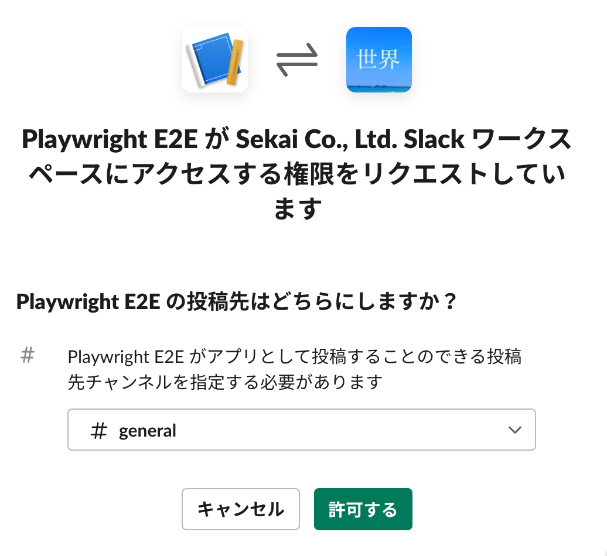

[README](../README.md) > Notification

# Notification

## Slack
See https://www.npmjs.com/package/playwright-slack-report

Install.

```
npm install playwright-slack-report -D
```

### via Webhook
Create Slack app to get incoming webhook from https://api.slack.com/messaging/webhooks.





Modify your `playwright.config.ts` file to include the following:

```
reporter: [
  [
    "./node_modules/playwright-slack-report/dist/src/SlackReporter.js",
    {
      slackWebHookUrl: process.env.SLACK_HOOK,
      sendResults: "always", // "always" , "on-failure", "off"
    },
  ],
],
```

And add HOOK URL to `.env`:

```
# Slack
SLACK_HOOK="https://hooks.slack.com/services/HOOK_URL"
```

Notification sample:


### via Slack bot user
Only public channel.

See https://www.npmjs.com/package/playwright-slack-report#option-b---send-your-results-via-a-slack-bot-user

### send your JSON results via CLI
1. https://www.npmjs.com/package/playwright-slack-report#option-c---send-your-json-results-via-cli
2. https://playwright.dev/docs/test-sharding#merging-reports-from-multiple-shards

## Teams
See [Playwright Tests with MS Teams Webhook Notifications](https://medium.com/@dnsvikas.wins/playwright-tests-with-ms-teams-webhook-notifications-58508eeb909d)

