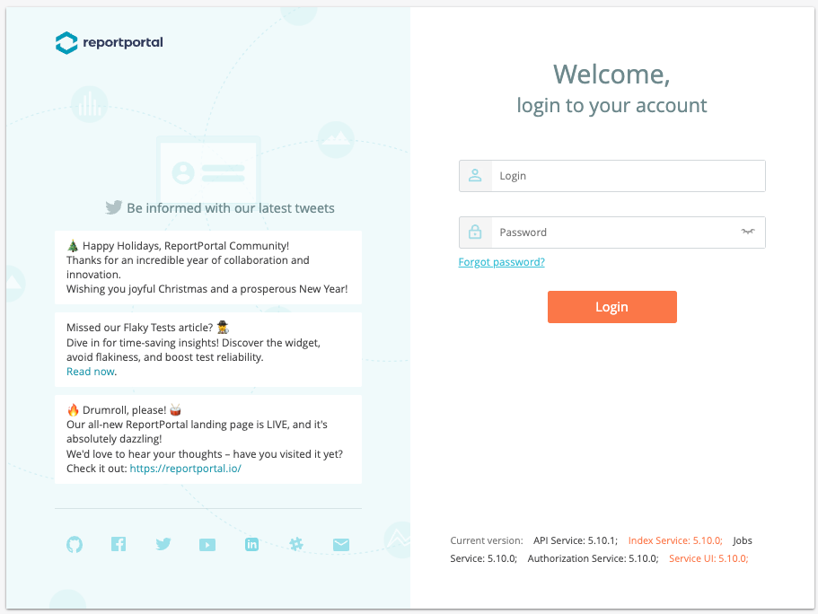
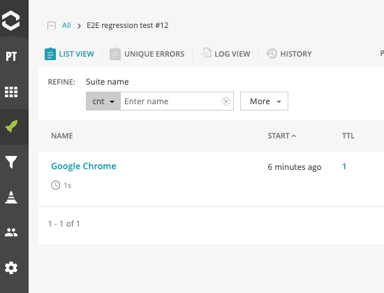

[README](../README.md) > Report Portal

# Report Portal

## Install Docker
See https://reportportal.io/installation

## Configure and deploy ReportPortal

```
cd report-portal
curl -LO https://raw.githubusercontent.com/reportportal/reportportal/master/docker-compose.yml
docker-compose -p reportportal up -d --force-recreate
```

## Launch ReportPortal



Open `http://localhost:8080`.

Login by 

1. user: id `default`, pass `1q2w3e`
2. admin: id `superadmin`, pass `erebus`

Create project on http://localhost:8080/ui/#administrate/projects and set the member (e.g. default user or superadmin user) and assign the role as `Project Manager`(Requires member or higher role. Please see permission map on http://localhost:8080/ui/#playwrightwithreportportalproject/members).


## Integrate with Playwright
See https://github.com/reportportal/agent-js-playwright

Install agent:

```
cd playwright
npm install --save-dev @reportportal/agent-js-playwright
```

And add the key to `.env` like below:

```
REPORT_PORTAL_API_KEY='${YOUR_KEY}'
REPORT_PORTAL_URL='http://localhost:8080/api/v1'
REPORT_PORTAL_PROJECT_NAME='${PROJECT_NAME}'
REPORT_PORTAL_LAUNCH_NAME='${LAUNCH_NAME}'
```

API key is here: http://localhost:8080/ui/#userProfile/apiKeys
You can also see the config example here: http://localhost:8080/ui/#userProfile/configExamples

Add the config to `playwright.config.ts`:

Sample: https://github.com/reportportal/examples-js/blob/main/example-playwright/playwright.config.ts

```
...

export const rpConfig = {
  apiKey: process.env.REPORT_PORTAL_API_KEY,
  endpoint: process.env.REPORT_PORTAL_URL,
  project: process.env.REPORT_PORTAL_PROJECT_NAME,
  launch : process.env.REPORT_PORTAL_LAUNCH_NAME,
};

export default defineConfig({
  ...

  reporter: [
    ['@reportportal/agent-js-playwright', rpConfig],
  ],
  ...
});
```

Add script to `package.json` file:

```
{
  "scripts": {
    "test": "npx playwright test --config=playwright.config.ts"
  }
}
```

Run test.

```
npx playwright test ./tests/sample.spec.ts:8

Running 1 test using 1 worker

(node:95847) Warning: Setting the NODE_TLS_REJECT_UNAUTHORIZED environment variable to '0' makes TLS connections and HTTPS requests insecure by disabling certificate verification.
  1 passed (1.4s)

ReportPortal Launch Link: http://localhost:8080/ui/#playwrightwithreportportalproject/launches/all/16
```

Open this link, you can see the view like below:



