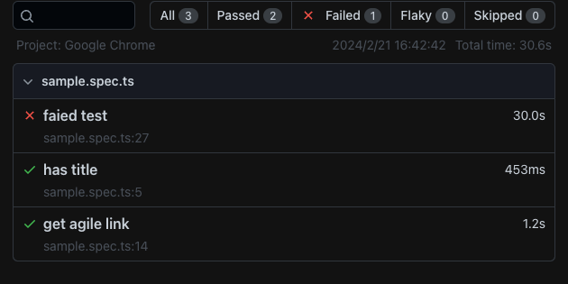
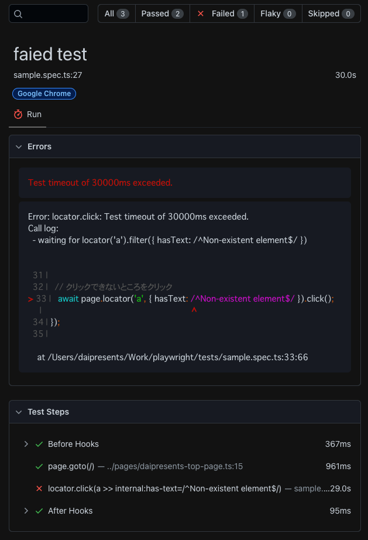

[README](../README.md) > Report

# Report
See https://playwright.dev/docs/test-reporters

## List reporter sample

```
npx playwright test ./tests/sample.spec.ts --reporter=list

Running 3 tests using 3 workers

  ✘  1 [Google Chrome] › sample.spec.ts:27:5 › faied test (30.0s)
  ✓  2 [Google Chrome] › sample.spec.ts:14:5 › get agile link (592ms)
  ✓  3 [Google Chrome] › sample.spec.ts:5:5 › has title (470ms)


  1) [Google Chrome] › sample.spec.ts:27:5 › faied test ────────────────────────────────────────────

    Test timeout of 30000ms exceeded.

    Error: locator.click: Test timeout of 30000ms exceeded.
    Call log:
      - waiting for locator('a').filter({ hasText: /^Non-existent element$/ })


      31 |
      32 |   // クリックできないところをクリック
    > 33 |   await page.locator('a', { hasText: /^Non-existent element$/, timeout: 1000 }).click();
         |                                                                  ^
      34 | });
      35 |

        at /Users/daipresents/Work/playwright/tests/sample.spec.ts:33:66

  1 failed
    [Google Chrome] › sample.spec.ts:27:5 › faied test ─────────────────────────────────────────────
  2 passed (30.6s)
```

Adding steps playwright.config.ts like below.

```
import { defineConfig } from '@playwright/test';

export default defineConfig({
  reporter: [['list', { printSteps: true }]],
});
```

And test it. But the output is same as no step setting.

```
npx playwright test ./tests/sample.spec.ts

Running 3 tests using 3 workers

  ✓  1 [Google Chrome] › sample.spec.ts:5:5 › has title (994ms)
  ✘  2 [Google Chrome] › sample.spec.ts:27:5 › faied test (30.0s)
  ✓  3 [Google Chrome] › sample.spec.ts:14:5 › get agile link (1.3s)


  1) [Google Chrome] › sample.spec.ts:27:5 › faied test ────────────────────────────────────────────

    Test timeout of 30000ms exceeded.

    Error: locator.click: Test timeout of 30000ms exceeded.
    Call log:
      - waiting for locator('a').filter({ hasText: /^Non-existent element$/ })


      31 |
      32 |   // クリックできないところをクリック
    > 33 |   await page.locator('a', { hasText: /^Non-existent element$/ }).click();
         |                                                                  ^
      34 | });
      35 |

        at /Users/daipresents/Work/playwright/tests/sample.spec.ts:33:66

  1 failed
    [Google Chrome] › sample.spec.ts:27:5 › faied test ─────────────────────────────────────────────
  2 passed (30.6s)
```

## Line reporter sample

```
npx playwright test ./tests/sample.spec.ts --reporter=line

Running 3 tests using 3 workers
  1) [Google Chrome] › sample.spec.ts:27:5 › faied test ────────────────────────────────────────────

    Test timeout of 30000ms exceeded.

    Error: locator.click: Test timeout of 30000ms exceeded.
    Call log:
      - waiting for locator('a').filter({ hasText: /^Non-existent element$/ })


      31 |
      32 |   // クリックできないところをクリック
    > 33 |   await page.locator('a', { hasText: /^Non-existent element$/ }).click();
         |                                                                  ^
      34 | });
      35 |

        at /Users/daipresents/Work/playwright/tests/sample.spec.ts:33:66

  1 failed
    [Google Chrome] › sample.spec.ts:27:5 › faied test ─────────────────────────────────────────────
  2 passed (30.5s)
```

## Dot reporter sample

```
npx playwright test ./tests/sample.spec.ts --reporter=dot 

Running 3 tests using 3 workers
··T

  1) [Google Chrome] › sample.spec.ts:27:5 › faied test ────────────────────────────────────────────

    Test timeout of 30000ms exceeded.

    Error: locator.click: Test timeout of 30000ms exceeded.
    Call log:
      - waiting for locator('a').filter({ hasText: /^Non-existent element$/ })


      31 |
      32 |   // クリックできないところをクリック
    > 33 |   await page.locator('a', { hasText: /^Non-existent element$/ }).click();
         |                                                                  ^
      34 | });
      35 |

        at /Users/daipresents/Work/playwright/tests/sample.spec.ts:33:66

  1 failed
    [Google Chrome] › sample.spec.ts:27:5 › faied test ─────────────────────────────────────────────
  2 passed (30.6s)
```

## HTML reporter sample

```
npx playwright test ./tests/sample.spec.ts --reporter=html

Running 3 tests using 3 workers
  1) [Google Chrome] › sample.spec.ts:27:5 › faied test ────────────────────────────────────────────

    Test timeout of 30000ms exceeded.

    Error: locator.click: Test timeout of 30000ms exceeded.
    Call log:
      - waiting for locator('a').filter({ hasText: /^Non-existent element$/ })


      31 |
      32 |   // クリックできないところをクリック
    > 33 |   await page.locator('a', { hasText: /^Non-existent element$/ }).click();
         |                                                                  ^
      34 | });
      35 |

        at /Users/daipresents/Work/playwright/tests/sample.spec.ts:33:66

  1 failed
    [Google Chrome] › sample.spec.ts:27:5 › faied test ─────────────────────────────────────────────
  2 passed (30.6s)

  Serving HTML report at http://localhost:9323. Press Ctrl+C to quit.
```

Sample images are below.




If you want to open the report, please use this command as below.

```
npx playwright show-report
```


## BLOB reporter sample

Getting all data and use blob file for customized report.

```
npx playwright test ./tests/sample.spec.ts --reporter=blob

Running 3 tests using 3 workers
  1) [Google Chrome] › sample.spec.ts:27:5 › faied test ────────────────────────────────────────────

    Test timeout of 30000ms exceeded.

    Error: locator.click: Test timeout of 30000ms exceeded.
    Call log:
      - waiting for locator('a').filter({ hasText: /^Non-existent element$/ })


      31 |
      32 |   // クリックできないところをクリック
    > 33 |   await page.locator('a', { hasText: /^Non-existent element$/ }).click();
         |                                                                  ^
      34 | });
      35 |

        at /Users/daipresents/Work/playwright/tests/sample.spec.ts:33:66

  1 failed
    [Google Chrome] › sample.spec.ts:27:5 › faied test ─────────────────────────────────────────────
  2 passed (30.6s)
```

Check blob file in `blob-report/report.zip`.


## JSON reporter sample

```
npx playwright test ./tests/sample.spec.ts --reporter=json
{
  "config": {
    "configFile": "/Users/daipresents/Work/playwright/playwright.config.ts",
    "rootDir": "/Users/daipresents/Work/playwright/tests",
    "forbidOnly": false,
    "fullyParallel": true,
    "globalSetup": null,
    "globalTeardown": null,
    "globalTimeout": 0,
    "grep": {},
    "grepInvert": null,
    "maxFailures": 0,
    "metadata": {
      "actualWorkers": 3
    },
    "preserveOutput": "always",
    "reporter": [
      [
        "json"
      ]
    ],
    "reportSlowTests": {
      "max": 5,
      "threshold": 15000
    },
    "quiet": false,
    "projects": [
      {
        "outputDir": "/Users/daipresents/Work/playwright/test-results",
        "repeatEach": 1,
        "retries": 0,
        "id": "Google Chrome",
        "name": "Google Chrome",
        "testDir": "/Users/daipresents/Work/playwright/tests",
        "testIgnore": [],
        "testMatch": [
          "**/*.@(spec|test).?(c|m)[jt]s?(x)"
        ],
        "timeout": 30000
      }
    ],
    "shard": null,
    "updateSnapshots": "missing",
    "version": "1.41.1",
    "workers": 5,
    "webServer": null
  },
  "suites": [
    {
      "title": "sample.spec.ts",
      "file": "sample.spec.ts",
      "column": 0,
      "line": 0,
      "specs": [
        {
          "title": "has title",
          "ok": true,
          "tags": [],
          "tests": [
            {
              "timeout": 30000,
              "annotations": [],
              "expectedStatus": "passed",
              "projectId": "Google Chrome",
              "projectName": "Google Chrome",
              "results": [
                {
                  "workerIndex": 0,
                  "status": "passed",
                  "duration": 463,
                  "errors": [],
                  "stdout": [],
                  "stderr": [],
                  "retry": 0,
                  "startTime": "2024-02-21T07:50:52.556Z",
                  "attachments": []
                }
              ],
              "status": "expected"
            }
          ],
          "id": "b92766bcf73bd5c029a8-aceec34c6ede2bf0c566",
          "file": "sample.spec.ts",
          "line": 5,
          "column": 5
        },
        {
          "title": "get agile link",
          "ok": true,
          "tags": [],
          "tests": [
            {
              "timeout": 30000,
              "annotations": [],
              "expectedStatus": "passed",
              "projectId": "Google Chrome",
              "projectName": "Google Chrome",
              "results": [
                {
                  "workerIndex": 1,
                  "status": "passed",
                  "duration": 587,
                  "errors": [],
                  "stdout": [],
                  "stderr": [],
                  "retry": 0,
                  "startTime": "2024-02-21T07:50:52.556Z",
                  "attachments": []
                }
              ],
              "status": "expected"
            }
          ],
          "id": "b92766bcf73bd5c029a8-d15b4972ea9764541107",
          "file": "sample.spec.ts",
          "line": 14,
          "column": 5
        },
        {
          "title": "faied test",
          "ok": false,
          "tags": [],
          "tests": [
            {
              "timeout": 30000,
              "annotations": [],
              "expectedStatus": "passed",
              "projectId": "Google Chrome",
              "projectName": "Google Chrome",
              "results": [
                {
                  "workerIndex": 2,
                  "status": "timedOut",
                  "duration": 30000,
                  "error": {
                    "message": "\u001b[31mTest timeout of 30000ms exceeded.\u001b[39m"
                  },
                  "errors": [
                    {
                      "message": "\u001b[31mTest timeout of 30000ms exceeded.\u001b[39m"
                    },
                    {
                      "location": {
                        "file": "/Users/daipresents/Work/playwright/tests/sample.spec.ts",
                        "column": 66,
                        "line": 33
                      },
                      "message": "Error: locator.click: Test timeout of 30000ms exceeded.\nCall log:\n  \u001b[2m- waiting for locator('a').filter({ hasText: /^Non-existent element$/ })\u001b[22m\n\n\n\u001b[0m \u001b[90m 31 |\u001b[39m\u001b[0m\n\u001b[0m \u001b[90m 32 |\u001b[39m   \u001b[90m// クリックできないところをクリック\u001b[39m\u001b[0m\n\u001b[0m\u001b[31m\u001b[1m>\u001b[22m\u001b[39m\u001b[90m 33 |\u001b[39m   \u001b[36mawait\u001b[39m page\u001b[33m.\u001b[39mlocator(\u001b[32m'a'\u001b[39m\u001b[33m,\u001b[39m { hasText\u001b[33m:\u001b[39m \u001b[35m/^Non-existent element$/\u001b[39m })\u001b[33m.\u001b[39mclick()\u001b[33m;\u001b[39m\u001b[0m\n\u001b[0m \u001b[90m    |\u001b[39m                                                                  \u001b[31m\u001b[1m^\u001b[22m\u001b[39m\u001b[0m\n\u001b[0m \u001b[90m 34 |\u001b[39m })\u001b[33m;\u001b[39m\u001b[0m\n\u001b[0m \u001b[90m 35 |\u001b[39m\u001b[0m\n\n\u001b[2m    at /Users/daipresents/Work/playwright/tests/sample.spec.ts:33:66\u001b[22m"
                    }
                  ],
                  "stdout": [],
                  "stderr": [],
                  "retry": 0,
                  "startTime": "2024-02-21T07:50:52.556Z",
                  "attachments": []
                }
              ],
              "status": "unexpected"
            }
          ],
          "id": "b92766bcf73bd5c029a8-c164d0bddc9f214bc244",
          "file": "sample.spec.ts",
          "line": 27,
          "column": 5
        }
      ]
    }
  ],
  "errors": [],
  "stats": {
    "startTime": "2024-02-21T07:50:52.330Z",
    "duration": 30590.01,
    "expected": 2,
    "skipped": 0,
    "unexpected": 1,
    "flaky": 0
  }
}
```

## Third party reporter showcase

### Allure
See https://www.npmjs.com/package/allure-playwright and https://allurereport.org/docs/gettingstarted-installation/

Weekly Downloads: over 156,000 (2024/02/21).

#### Installation
```
# For Mac
brew install allure
```

Windows is here: https://allurereport.org/docs/gettingstarted-installation/#install-via-scoop-for-windows

and install npm package

```
npm i -D @playwright/test allure-playwright
```

#### Getting report
Default output folder is in `allure-results/`.

Generate and open Allure report by this command.

```
allure generate ./allure-results --clean && allure open ./allure-report
```


### Argos Visual Testing
See https://argos-ci.com/docs/playwright


### Currents
See https://www.npmjs.com/package/@currents/playwright and https://currents.dev/playwright

Weekly Downloads: over 14,000 (2024/02/21).

#### Installation

```
npm install @currents/playwright
```

### Monocart
See https://github.com/cenfun/monocart-reporter

#### Installatin
```
npm i -D monocart-reporter
```

#### Getting report

```
npx playwright test ./tests/sample.spec.ts --reporter=monocart-reporter
[MR] generating report data ...
[MR] generating test report ...
[MR] Test Report
┌─────────────┬────────────────────┐
│ Tests       │ 3                  │
│ ├ Passed    │ 2 (66.7%)          │
│ ├ Flaky     │ 0 (0.0%)           │
│ ├ Skipped   │ 0 (0.0%)           │
│ └ Failed    │ 1 (33.3%)          │
│ Steps       │ 38                 │
│ Suites      │ 1                  │
│ ├ Projects  │ 1                  │
│ ├ Files     │ 1                  │
│ ├ Describes │ 0                  │
│ └ Shards    │ 0                  │
│ Retries     │ 0                  │
│ Errors      │ 2                  │
│ Logs        │ 0                  │
│ Attachments │ 0                  │
│ Artifacts   │ 0                  │
│ Playwright  │ v1.41.2            │
│ Date        │ 2024/2/21 17:38:43 │
│ Duration    │ 31.7s              │
└─────────────┴────────────────────┘
[MR] html report: test-results/report.html (json: test-results/report.json)
[MR] view report: npx monocart show-report test-results/report.html
```

Open the report.

```
npx monocart show-report test-results/report.html
```


ReactアプリをPlaywrightでテストする〜レポート機能〜 https://qiita.com/rikayoshimura/items/dc5d2a1c3a4a4c40ab5c
Playwrightのサードパーティレポーターを試してみる https://zenn.dev/koheii/articles/2ec38ffbd33ca4


