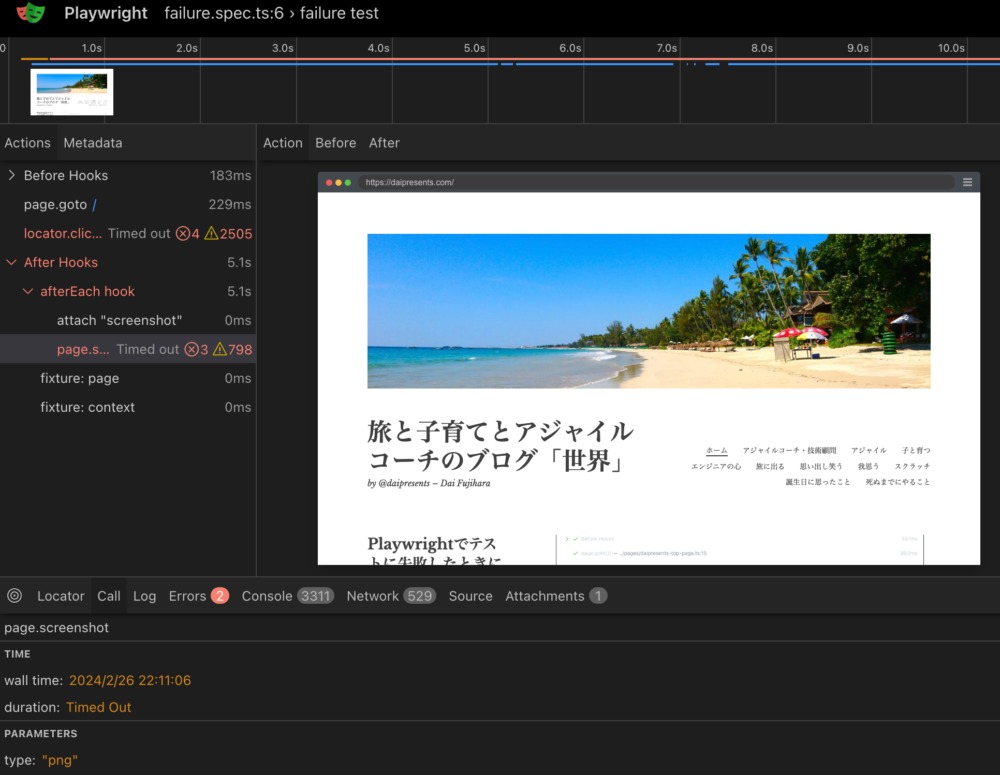

[README](../README.md) > Trace viewer

# Trace viewer
See https://playwright.dev/docs/trace-viewer

```
npx playwright test --trace on
```

Setting example.

```
import { defineConfig } from '@playwright/test';
export default defineConfig({
  retries: 1,
  use: {
    trace: 'on-first-retry',
  },
});
```

If you set the option "on", Playwright trace for each test. But not recommended as it's performance heavy.

When your test finished, you can use this command to check the report.

```
npx playwright show-trace test-results/failure-failure-test-Google-Chrome-retry1/trace.zip     
```

The report is like below.



You can use UI mode for realtime monitoring like below.

```
npx playwright test ./tests/failure.spec.ts --ui
```

You can see this view. This is very similar to trace view.


# trace.playwright.dev

But if you check the result after testing on CI etc, you can use trace viewer.

See https://trace.playwright.dev/


You can upload `trace.zip` from `/test-results`. After that, you can see the log like below.

And if you want to use this tool on your local environment, you can install chrome app from https://trace.playwright.dev/.


